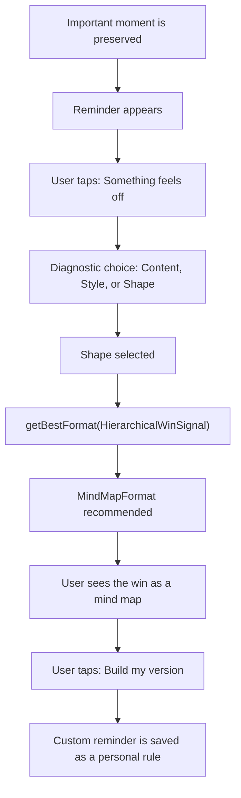

# Re_Call iOS User Flow: PRD #26 Format Judgment

## PRD #26

`User Story: Format Judgment`

As a user, when a reminder feels wrong after an important win, I want Re_Call to help me decide whether the issue is the content, the styling, or the answer shape, so I can improve the template instead of abandoning the insight.

## Design Constraint From Adam's Aptitude Profile

The UX should not depend on the user mentally assembling a spatial model.

Use:

- Ordered steps
- Labeled choices
- Explicit comparisons
- Tables, rows, and short forms
- One decision per screen
- Visible proof instead of hidden graph magic

Avoid:

- Abstract spatial dashboards as the first surface
- Unlabeled node webs
- Gesture-heavy interactions
- Big blank canvases that require the user to infer structure

## First Flow



## Screen Set

1. `Today`
   - Shows the preserved thread.
   - Makes the user feel: Re_Call remembers the context around this.

2. `Reminder`
   - Shows the current reminder.
   - Offers: `This helps`, `Something feels off`, `Remind me later`.

3. `Format Judgment`
   - The PRD #26 screen.
   - Asks: `What feels wrong?`
   - Choices: `Content`, `Style`, `Shape`.

4. `Best Format`
   - Shows the rule proof:
     `HierarchicalWinSignal -> MindMapFormat`.
   - Does not expose the full ontology.

5. `Mind Map`
   - Converts the reminder into the shape that preserves the hierarchy.
   - Asks whether this is a better match for what happened.

6. `Custom Reminder`
   - Lets the user make the reminder their own.
   - Saves the custom version as a personal rule.

## Success Signal

The experience is working if the user thinks:

```text
Interesting. I like this, but I have a better custom version for my life.
```

That reaction is the behavioral proof that the UI revealed a relational connection instead of merely sending a notification.

## Local Wireframe

Open:

```text
/Users/adamblair/Documents/Re_Call/wireframes/format-judgment-ios.html
```
